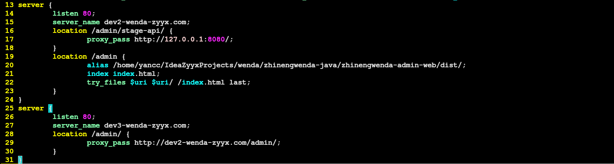
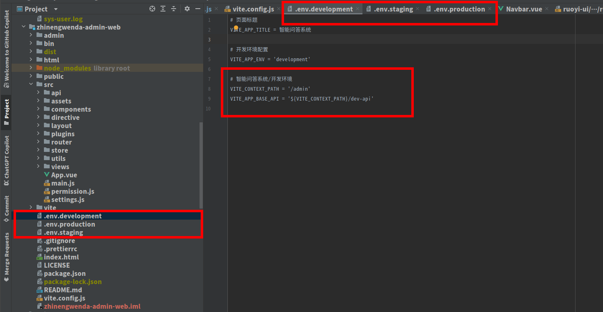
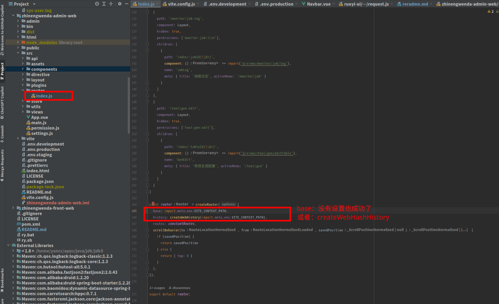
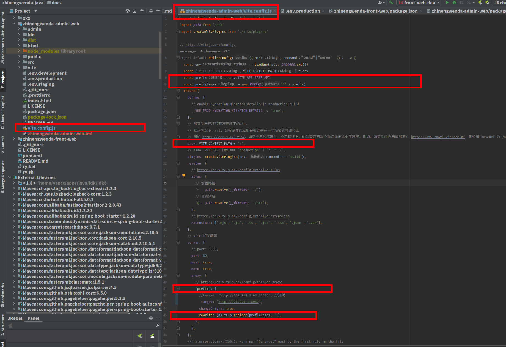
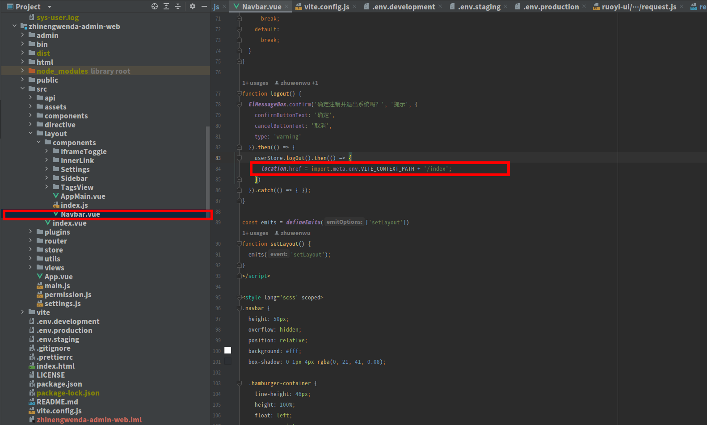
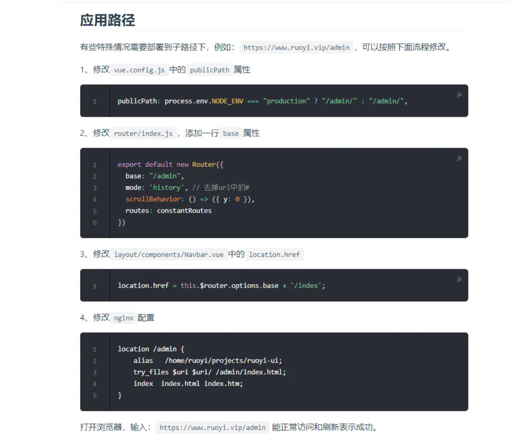
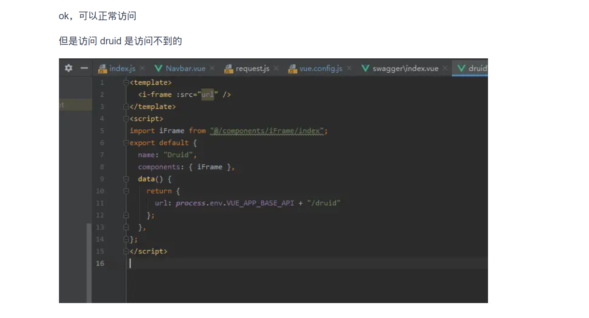

## vue 添加context_path, vue 项目添加前缀，vue 项目添加子路径

### nginx 配置

### 1. vue vite 添加context_path

#### [参考文章](https://blog.csdn.net/weixin_44959182/article/details/125884698)

#### 第一步

#### 第二步

#### 第三步

#### 第四步

### 2. vue 添加context_path

#### [参考文章](https://gitee.com/y_project/RuoYi-Vue/issues/I4D5PQ)

#### 第一步

#### 第二步

