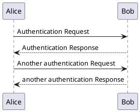

# PlantUML 画图

由 `docsify-plantuml` 插件渲染（见 `index.html`），文档中直接写 plantuml 代码块即可。

```plantuml
@startuml
Alice -> Bob: Authentication Request
Bob --> Alice: Authentication Response

Alice -> Bob: Another authentication Request
Alice <-- Bob: another authentication Response
@enduml
```

参考:
- https://github.com/imyelo/docsify-plantuml
- https://plantuml.com/zh/
